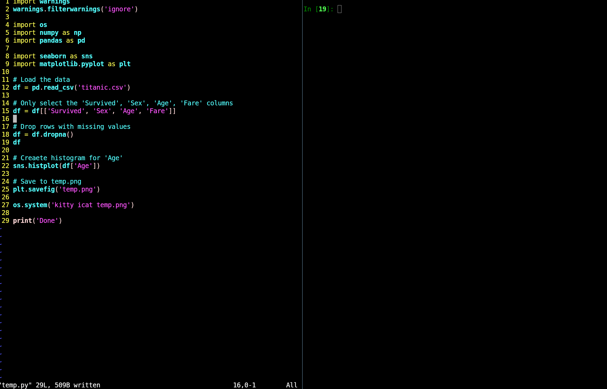

# My Neovim Configuration

This is the neovim configuration I am currently using. It is built on top of lazy-vim and it combines both deferred plugin loading and lazy loading to produce an incredibly fast start_time (the contents of the file are show immediately, while some plugins are finishing loading up).

### Preview neovim_preview.gif (in current directory)

### Plugins
- https://github.com/jackMort/ChatGPT.nvim
- https://github.com/hrsh7th/nvim-cmp
- https://github.com/zbirenbaum/copilot.lua
- https://github.com/3rd/image.nvim
- https://github.com/mikesmithgh/kitty-scrollback.nvim
- https://github.com/jbyuki/nabla.nvim
- https://github.com/nvim-tree/nvim-tree.lua
- https://github.com/nvim-telescope/telescope.nvim
- https://github.com/nvim-treesitter/nvim-treesitter
